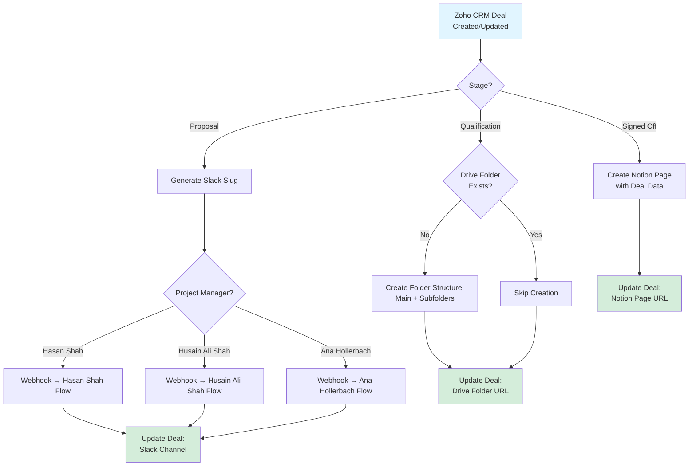

# Zoho CRM → Slack, Google Drive & Notion Automation

A comprehensive end-to-end automation system for project onboarding that integrates **Zoho CRM**, **Slack**, **Google Drive**, and **Notion** to streamline project management workflows.

## Table of Contents

- [Overview](#overview)
- [Features](#features)
- [Architecture](#architecture)
- [Prerequisites](#prerequisites)
- [Setup Guide](#setup-guide)
  - [Zoho CRM Configuration](#zoho-crm-configuration)
  - [Slack Workflow Setup](#slack-workflow-setup)
  - [Google Drive Setup](#google-drive-setup)
  - [Notion Setup](#notion-setup)
  - [Zoho Flow Configuration](#zoho-flow-configuration)
- [How It Works](#how-it-works)
- [Configuration Reference](#configuration-reference)
- [Testing](#testing)
- [Troubleshooting](#troubleshooting)
- [Extending the System](#extending-the-system)

---

## Overview

This automation monitors Zoho CRM **Deals** and automatically performs stage-specific actions to set up project infrastructure:

- **Proposal Stage** → Creates dedicated Slack channels via Project Manager-specific workflows
- **Qualification Stage** → Generates standardized Google Drive folder structures
- **Signed Off Stage** → Initializes Notion project pages with Deal data

All created resources are automatically linked back to the Deal record for seamless access.

---

## Features

✅ **Automated Slack Channel Creation** with PM-specific workflows  
✅ **Standardized Google Drive Folder Structure** with subfolder templates  
✅ **Notion Page Generation** from Deal data  
✅ **Idempotent Operations** to prevent duplicate resource creation  
✅ **Smart Channel Naming** with Slack-compliant slug generation  
✅ **Automatic Deal Updates** with resource links  

---

## Architecture



---

## Prerequisites

### Required Accounts & Access
- Zoho CRM with **Deals** module access
- Zoho Flow subscription
- Slack workspace with **Workflow Builder** enabled
- Google Drive account with folder creation permissions
- Notion workspace with integration capabilities

### Required Permissions
- **Zoho CRM**: Read/Write access to Deals module
- **Slack**: Channel creation permissions, Workflow Builder access
- **Google Drive**: Editor permissions on root project folder
- **Notion**: Integration access to target database

---

## Setup Guide

### Zoho CRM Configuration

Add the following custom fields to your **Deals** module:

| Field Name | Type | Description |
|------------|------|-------------|
| **Deal Name** | Text | Project identifier (used for naming) |
| **Stage** | Picklist | Must include: `Proposal`, `Qualification`, `Signed Off` |
| **Project Manager** | Picklist | Values: `Hasan Shah`, `Husain Ali Shah`, `Ana Hollerbach` |
| **Slack Channel** | Text/URL | Stores channel name or link |
| **Drive Folder URL** | URL | Stores main project folder link |
| **Notion Page URL** | URL | Stores Notion page link |

**Optional but recommended:**
- Client Name
- Short Code
- Start Date
- Budget
- Deal Owner

---

### Slack Workflow Setup

Create **three separate workflows** in Slack Workflow Builder:

#### 1. Hasan Shah Flow
1. Go to Slack → **Tools** → **Workflow Builder**
2. Click **Create** → Name it: `Hasan Shah Flow`
3. **Trigger**: Select *Webhook*
4. **Add Variable**: Create `channel_name` input
5. **Add Step**: *Create a channel*
   - Channel name: Use variable `channel_name`
   - Optional: Add default members, set visibility
6. **Publish** and copy the **Webhook URL**

#### 2. Husain Ali Shah Flow
Repeat the above steps with the name `Husain Ali Shah Flow`

#### 3. Ana Hollerbach Flow
Repeat the above steps with the name `Ana Hollerbach Flow`

> **Important:** Save all three webhook URLs for the Zoho Flow configuration.

---

### Google Drive Setup

1. Create a **root folder** for all projects (e.g., "Client Projects")
2. Note the **Folder ID** from the URL:
   ```
   https://drive.google.com/drive/folders/[FOLDER_ID]
   ```
3. Ensure the connected Google account has **Editor** permissions

**Folder Structure Template:**
```
<Project Name>/
├── Assets/
├── Source/
├── Storyboard/
└── Brief/
```

---

### Notion Setup

1. Create a **database** for projects (if not already existing)
2. Add the following properties:

| Property Name | Type | Description |
|---------------|------|-------------|
| Name | Title | Project/Deal name |
| Client | Text | Client/Account name |
| PM | Select | Project Manager |
| Stage | Select | Deal stage |
| Slack Channel | URL | Link to Slack channel |
| Drive Folder | URL | Link to Drive folder |
| Start Date | Date | Project start date |
| Budget | Number | Project budget |

3. Create a **Notion Integration**:
   - Go to https://www.notion.so/my-integrations
   - Click **New integration**
   - Copy the **Integration Token**
4. **Share** your database with the integration

---

### Zoho Flow Configuration

#### Step 1: Create the Flow

1. Go to **Zoho Flow** → **Create Flow**
2. **Trigger**: *Zoho CRM* → *Entry created or updated* → Module: **Deals**

#### Step 2: Add Stage Decision

Add a **Decision** node with three branches:

**Branch 1: Proposal** → `Deal.Stage equals "Proposal"`  
**Branch 2: Qualification** → `Deal.Stage equals "Qualification"`  
**Branch 3: Signed Off** → `Deal.Stage equals "Signed Off"`

---

#### Proposal Branch: Slack Channel Creation

1. **Function Node**: `slack_slug`
   ```javascript
   // Generate Slack-compliant channel name
   channelName = dealName.toLowerCase()
     .replace(/[^a-z0-9-]/g, '-')
     .replace(/--+/g, '-')
     .replace(/^-|-$/g, '')
     .substring(0, 80) || 'project-' + dealId;
   ```

2. **Decision Node**: Project Manager
   - Branch for each PM: `Deal.Project_Manager equals "Hasan Shah"`

3. **Webhook Node** (one per PM):
   - Method: **POST**
   - URL: Use respective webhook URL
   - Payload:
   ```json
   {
     "channel_name": "${slack_slug}",
     "deal_id": "${Deal.Id}",
     "deal_name": "${Deal.Deal_Name}",
     "client": "${Deal.Account_Name}",
     "owner": "${Deal.Owner}"
   }
   ```

4. **Update Module Entry**: Write to `Slack Channel` field
   - Value: `#${slack_slug}`

---

#### Qualification Branch: Google Drive Folders

1. **Google Drive - Search Files**
   - Query: `name='${slack_slug}' and '${DRIVE_ROOT_FOLDER_ID}' in parents`

2. **Decision Node**: Check if folder exists
   - If **No Results**:
     - **Create Folder**: Main project folder
     - **Create Folder**: Assets (parent: main folder)
     - **Create Folder**: Source (parent: main folder)
     - **Create Folder**: Storyboard (parent: main folder)
     - **Create Folder**: Brief (parent: main folder)

3. **Update Module Entry**: Write to `Drive Folder URL` field
   - Value: Main folder URL

---

#### Signed Off Branch: Notion Page

1. **Notion - Create Page**
   - Database: Select your projects database
   - Properties:
     - Name: `${Deal.Deal_Name}`
     - Client: `${Deal.Account_Name}`
     - PM: `${Deal.Project_Manager}`
     - Stage: `${Deal.Stage}`
     - Slack Channel: `${Deal.Slack_Channel}`
     - Drive Folder: `${Deal.Drive_Folder_URL}`

2. **Update Module Entry**: Write to `Notion Page URL` field
   - Value: `${NotionPage.URL}`

---

## How It Works

### Channel Naming Algorithm

The `slack_slug` function ensures Slack-compliant channel names:

1. Convert Deal Name to lowercase
2. Replace spaces and special characters with hyphens
3. Remove invalid characters (keep only `a-z`, `0-9`, `-`)
4. Collapse consecutive hyphens
5. Trim leading/trailing hyphens
6. Truncate to 80 characters
7. Fallback to `project-<deal_id>` if empty

**Example:**  
`"ACME TVC – Spring Launch"` → `"acme-tvc-spring-launch"`

### Idempotency

The flow checks existing field values before creating resources:
- If `Slack Channel` is already populated → skip Slack creation
- If `Drive Folder URL` exists → skip Drive creation
- If `Notion Page URL` exists → skip Notion creation

---

## Configuration Reference

Store these values as **Zoho Flow connections** or **variables**:

| Variable | Description | Example |
|----------|-------------|---------|
| `SLACK_WEBHOOK_HASAN` | Webhook URL for Hasan's workflow | `https://hooks.slack.com/workflows/...` |
| `SLACK_WEBHOOK_HUSAIN` | Webhook URL for Husain's workflow | `https://hooks.slack.com/workflows/...` |
| `SLACK_WEBHOOK_ANA` | Webhook URL for Ana's workflow | `https://hooks.slack.com/workflows/...` |
| `DRIVE_ROOT_FOLDER_ID` | Parent folder ID for projects | `1a2B3c4D5e6F7g8H9i0J` |
| `NOTION_TOKEN` | Notion integration secret | `secret_abc123...` |
| `NOTION_DB_ID` | Target database ID | `a1b2c3d4e5f6...` |

---

## Testing

### Test Checklist

1. **Proposal Stage Test**
   - [ ] Create a test Deal with Stage = `Proposal`
   - [ ] Set each Project Manager value
   - [ ] Verify Slack channel is created
   - [ ] Verify `Slack Channel` field is updated

2. **Qualification Stage Test**
   - [ ] Update Deal Stage to `Qualification`
   - [ ] Verify Drive folder structure is created
   - [ ] Verify `Drive Folder URL` field is updated
   - [ ] Check all subfolders are present

3. **Signed Off Stage Test**
   - [ ] Update Deal Stage to `Signed Off`
   - [ ] Verify Notion page is created
   - [ ] Verify all Deal data is mapped correctly
   - [ ] Verify `Notion Page URL` field is updated

4. **Idempotency Test**
   - [ ] Re-run the flow on the same Deal
   - [ ] Verify no duplicate resources are created

---


---

## Extending the System

### Add More Project Managers

1. Create a new Slack workflow for the new PM
2. Add a new branch in the PM Decision node
3. Add webhook URL to configuration
4. Update Project Manager picklist in Zoho CRM

### Customize Folder Structure

Modify the Drive branch to add/remove subfolders:
```
<Project Name>/
├── Assets/
│   ├── Images/
│   └── Videos/
├── Source/
├── Deliverables/
└── Archive/
```

### Add Notifications

Create a final step that posts to a monitoring channel:
```json
{
  "text": "✅ New project setup complete",
  "deal": "${Deal.Deal_Name}",
  "slack": "${Deal.Slack_Channel}",
  "drive": "${Deal.Drive_Folder_URL}",
  "notion": "${Deal.Notion_Page_URL}"
}
```

### Auto-add Team Members

In Slack workflows, add a step to invite team members:
- Project Manager
- Deal Owner
- Default team members

---

## Support & Maintenance

### Monitoring

Regularly check:
- Zoho Flow execution history for failures
- Slack workspace for orphaned channels
- Drive folder for correct structures
- Notion database for incomplete pages

### Updates

When modifying the flow:
1. Test in a development environment first
2. Document changes in this README
3. Update version number below
4. Communicate changes to team

---

## Version History

| Version | Date | Changes |
|---------|------|---------|
| 1.0 | Initial | Base automation with Slack, Drive, and Notion integration |

---

## License

Internal use only - [Your Company Name]

## Contact

For questions or issues, contact: [Your Team/Email]